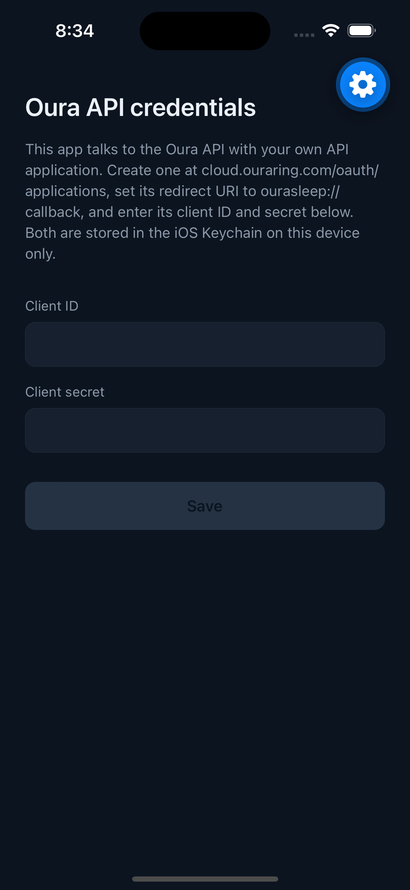

# Oura Sleep Tracker

> Minimally tracks your sleep and heart data without all the nannying of the
> native app. Absolutely free and open source. No data kept or tracked, other
> than whatever Oura does with your data. Runs completely locally on your
> iPhone.

A personal iPhone app for Oura Ring owners who only want the sleep data:
score and contributors, sleep stages, overnight heart rate and HRV, timing
and efficiency, history, and trends. Styled after the Oura app you already
know, following your phone's dark/light setting.



_(More screenshots coming once there's a night of data to show.)_

## What this is / what this deliberately isn't

**Is:** sleep score + contributors, hypnogram, stage totals, overnight
HR/HRV charts, bedtime/wake/efficiency/latency, scrollable history, and
score/duration trends over 2 weeks / 1 month / 3 months. Works offline with
the last-synced data.

**Isn't:** readiness, activity rings, stress, SpO2, workouts, insights,
coaching, streaks, notifications, or any copy that tells you how to feel
about your night. If you had a rough night, the app assumes you already know.

You keep the official Oura app installed — the ring syncs to Oura's cloud
through it, and this app reads that same cloud API.

## How your data flows

Your phone talks directly to the Oura API. There is no server, no analytics,
and no tracking — see [PRIVACY.md](PRIVACY.md). You register your **own**
Oura API application, so nobody (including this repo's author) sits between
you and your data. Your OAuth client secret lives on your own device in the
iOS Keychain; that's an explicit, acceptable tradeoff for a personal app
whose OAuth registration you own.

## Prerequisites

- Node 22+ and npm
- An iPhone and an Oura Ring (Gen 3+ with an active data connection to Oura)
- [Expo account](https://expo.dev) if you use EAS Build (recommended path)
- Apple Developer account for installing on your phone:
  - **Paid ($99/yr):** installs stay put; TestFlight available via EAS.
  - **Free:** local builds work but Apple expires them after 7 days — you
    re-install from your Mac weekly.

## 1. Register your Oura API application

1. Go to [developer.ouraring.com/applications](https://developer.ouraring.com/applications)
   and sign in with your Oura account.
2. Create an application. The form's required URLs can point at your fork of
   this repo (or this repo itself):
   - **Web app:** your repo URL
   - **Terms of Service:** `<repo>/blob/main/TERMS.md`
   - **Privacy Policy:** `<repo>/blob/main/PRIVACY.md`
3. Set the **redirect URI** to exactly: `ourasleep://callback`
4. Note the **client ID** and **client secret** — the app asks for them on
   first launch and stores them in the iOS Keychain.

The app requests the `daily`, `heartrate`, and `personal` scopes.

## 2. Install and run

```bash
git clone https://github.com/androosk/oura-sleep-tracker.git
cd oura-sleep-tracker
npm install
```

**Develop / try it on the iOS Simulator:**

```bash
npx expo start --ios
```

**On your iPhone via EAS Build (recommended):**

```bash
npm install -g eas-cli
eas login
eas build --platform ios --profile production
eas submit --platform ios
```

Then install via TestFlight.

**Or a local build without EAS** (plugged-in iPhone, Xcode installed):

```bash
npx expo run:ios --device
```

## 3. First launch

1. Enter your client ID and secret on the setup screen.
2. Tap **Log in with Oura** — Oura's page opens, you approve, you're in.
3. If you haven't worn the ring recently the app says so plainly and
   populates after your next synced night. That's it — no streaks to start,
   nothing to configure.

## Development

```bash
npm test        # 187-test contract suite (Jest + RNTL)
npm run lint
npm run typecheck
```

The project was built contract-first: the tests in `src/__tests__/` were
written and approved before the implementation, and judgment-based criteria
(copy tone, Oura-likeness) live in `evals/`. The copy tests enforce the
no-nanny rule mechanically — a banned-phrase list, no exclamation marks, no
emoji.

## License

[MIT](LICENSE). Not affiliated with or endorsed by Oura Health Oy — see
[TERMS.md](TERMS.md).
